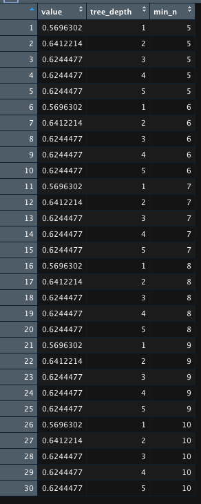
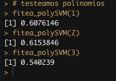
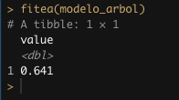
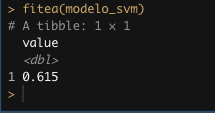
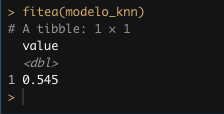
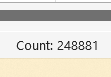
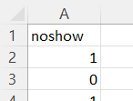

<style>
body {
text-align: justify}
</style>

# Prediciendo sobreventa de asientos en la industria aérea

### Integrantes:
  - Isidora Lin Huang
  - Amparo Morel Pantoja
  - Yin Zhong Cai

#### Descripción

En la industria aérea, existe un fenómeno llamado no-show el cual es cuando pasajeros que compraron asientos en un vuelo no se presentan en la puerta del vuelo, lo cual puede ser por distintas razones como: atrasos en las conexiones de vuelos, cambio de fecha de pasajes, clima, atrasos en llegar al aeropuerto, entre otros. De esto que, existe un número significativo de pasajeros que no se presentan a sus vuelos, provocando que los vuelos salgan con algunos asientos vacíos, generando así pérdidas grandes para las aerolíneas. Y estas para mitigar estos costos, suelen permitir la sobre-reserva de algunos asientos en sus vuelos. De esta manera es que, es importante la estimación de no show, ya que si es correcta la aerolínea puede salir con todos sus asientos ocupados, si la subestiman, pueden salir con asientos vacíos, y si la sobreestiman pueden incluso tener que dejar a pasajeros fuera del vuelo (llamado denied boarding). 

El objetivo de este proyecto es crear un programa computacional que permita a la aerolínea PANAM estimar si un vuelo tendrá más de 4 no show. En donde un vuelo es catalogado como 0, si es que tiene menos de 4 no show, y si un vuelo presenta 4 o más no show, es catalogado como 1. 

La base de datos con la que trabajaremos incluye aproximadamente un millón de vuelos de PANAM entre 2009 y 2012, con 21 variables. Además de una segunda base de datos de prueba con 248880 vuelos y 20 variables, ya que en este trabajo se le va a incluir la variable de no show, que es la que vamos a predecir.


#### -- Librerías a usar

En primer lugar, estas es la lista de librerías que usamos en este proyecto y la semilla que definimos para que nuestros resultados no varien:

```{r eval=FALSE}
pacman::p_load(tidymodels, tidyverse, discrim, naivebayes, caret, kknn, kernlab)
library(pROC)
library(Rtsne)
library(chron)
library(modelr)
library(lubridate)
library(MLmetrics)
set.seed(42)
```

#### -- Limpieza de datos

Empezamos importando nuestros datos en dos dataframes, uno llamado "data_train" con la primera base de datos y el otro llamado "data_eval" con la segunda base de datos entregada. 

```{r eval=FALSE}
filename = file.choose()
data_train = read.csv(filename)

filename = file.choose()
data_eval = read.csv(filename)
```

Luego a nuestros datos de entrenamiento (primer dataframe), discretizamos la variable (columna) no show, es decir, cambiamos una variable continua a una variable categórica. En este caso, si es mayor o igual a 4, es cambiado a un 1, y si es menos a 4, se le asigna un 0. Además en cuanto a las variables que corresponden a hora y fechas, le asignamos correctamente las medias correspondientes de hora y fecha, ya que estas se encuentran en caracteres, lo que dificulta el manejo de estas variables. De esta manera, a partir de la variable fecha, se derivan 3 columnas nuevas, con sus respectivos datos. Este proceso lo realizamos tanto para los datos de entrenamiento y los datos de evaluación. 

```{r eval=FALSE}
data_train <- data_train %>%
  mutate(
    noshow = ifelse(noshow >= 4, 1, 0), 
    noshow = factor(noshow),
    departure_time = chron(times=departure_time),
    date = as.Date(date),
    day = format(date, "%d"),
    month = format(date, "%m"),
    year = format(date, "%Y"))

data_eval <- data_eval %>%
  mutate(
    date = as.Date(date),
    day = format(date, "%d"),
    month = format(date, "%m"),
    year = format(date, "%Y"),
    departure_time = chron(times=departure_time))
```

También, en cuanto a las variables de los datos, descartaremos las varibles de "origin" y "destination", ya que consideramos que estas varibles, que son los areopuertos de origen y destino, no representan un valor de interes en nuestros datos. Además, en cuanto a las variables que representan las fechas de los vuelo, opinamos que es relevante predecir solo con la variable de los meses, ya que así tenemos una mirada general y significativa de las predicciones.  

```{r eval=FALSE}
data_train <- select(data_train, id, month, distance, noshow, pax_midlow, pax_high, pax_midhigh, pax_low, pax_freqflyer, group_bookings, out_of_stock, dom_cnx, int_cnx, p2p, departure_time, capacity, revenues_usd, bookings)

data_eval <- select(data_eval, id, month, distance, pax_midlow, pax_high, pax_midhigh, pax_low, pax_freqflyer, group_bookings, out_of_stock, dom_cnx, int_cnx, p2p, departure_time, capacity, revenues_usd, bookings)
```

Ahora, eliminamos los datos que presenten alguno NULL, en caso de que hayan. Para así tener un mejor manejo de nuestros datos y trabajamos con datos que tengan su información completa.

```{r eval=FALSE}
data_train= na.omit(data_train)
data_eval = na.omit(data_eval)

data_train <- data_train[!duplicated(data_train$id),]
data_eval <- data_eval[!duplicated(data_eval$id),]
```

Además, en este proyecto trabajaremos con un muestra aleatoria, la que fue determinada buscando 2500 datos que contenga una misma categoría en la variable de no show, es decir, con el número 1. Y otros 2500 con la otra categoría de no show, 0. Esto lo hacemos para trabajar con un balance entre los datos y que haya un equilibrio a la hora de predecir bien las dos categorías de no show, al tener la misma cantidad de datos en las dos. De esta manera, en este proyecto trabajaremos con una muestra de 5000 datos, lo cual ayudará a tener un progama más eficiente y que el análisis de datos sea menos complejo.
 

```{r eval=FALSE}
index_uno <- data_train$noshow == 1
data_uno <- data_train[index_uno,]
data_uno <- data_uno[sample(nrow(data_uno), 2500),]
data_cero <- data_train[!index_uno,]
data_cero <- data_cero[sample(nrow(data_cero), 2500),]
data_train_down <- rbind(data_cero, data_uno)

data_sample_train <- data_train_down[sample(1:nrow(data_train_down)),]
```


Luego, definimos la receta, lo cual indica que queremos predecir la variable de no show en base a las otras variables. También, actualizamos la variable de "id" y "fligth_number", asignando estas variables para ID y que no se usen en la predicción. Además, cambiamos los datos nominales en uno o más números binarios. Por último, eliminamos las variables que tengan solo el mismo valor para todos los datos, es decir, en donde no hay varianza en los datos de tal variable.    

```{r eval=FALSE}
receta <- 
  recipe(noshow ~ ., data = data_sample_train) %>% 
  update_role(id,fligth_number, new_role = "ID") %>% 
  step_dummy(all_nominal_predictors()) %>% 
  step_zv(all_predictors())
```

Por otra parte, dividimos de manera aleatoria nuestros datos de entrenamiento, "data_sample_train", con un 3/4 siendo datos para entrenar los modelos de clasificación y el resto corresponde a los datos de testeo para los modelos. 

```{r eval=FALSE}
data_split <- initial_split(data_sample_train, prop = 3/4)
train_data <- training(data_split)
test_data  <- testing(data_split)
```


### Modelo 1

Como primer modelo de clasificación para poder estimar el no show de un vuelo, utilizaremos el modelo de árboles de decisión. El cual es un modelo de clasificación discriminativo, ya que modela en base a una regla de clasificación directamente, que en este caso correspone a la categoría de no show. En el modelo de árbol, definimos 2 niveles de profundidad y como mínimo 6 nodos por hoja. Esto a partir de las comparaciones del modelo con diferentes niveles de profundidad en un rango entre 1 y 5; y en cuanto al mínimo de nodos comparamos entre 5 y 10.     


```{r eval=FALSE}
modelo_arbol <-
  decision_tree(tree_depth = 2, min_n = 6) %>% 
  set_engine("rpart") %>% 
  set_mode("classification")
```

El siguiente código, crea un dataframe con las comparaciones entre las distintas combinaciones de los niveles de profundidad con los mínimos de nodos, en los rangos a probar. Obteniéndose diferentes F1-score para las distintas combinaciones, donde esta medida se repitió para ciertas combinaciones, el cual corresponde a 0,6412214 y elegimos la combinación con el nivel de profundidad 2 y mínimo de 6 nodos por hoja. El F1-score es una medida de rendimiento para nuestros resultados. Esta medida se profundizará al medir el rendimiento de los modelos.

```{r eval=FALSE}
params <- expand.grid(tree_depth = 1:5, 
                      min_n = 5:10)

res <- map2_dfr(params$tree_depth, 
                params$min_n, 
                function(x,y)  
                  fitea(decision_tree(tree_depth = x, min_n = y) %>% 
                          set_engine("rpart") %>% 
                          set_mode("classification")))

res <- cbind(res, params)
```



### Modelo 2

En cuanto a nuestro segundo modelo de clasificación, usaremos el de máquinas de soporte vectorial, SVM, por sus siglas en inglés. Este modelo como el anterior es de tipo discriminativo, que busca la mejor manera de dividir un espacio, basandose en algunos datos de este, para separarlo en 2 zonas. Para luego construir un clasificador sobre esta división. En este modelo, el grado es el parámetro el cual tenemos que escoger, el cual representa el grado del polinomo en la que se basa el modelo. Esto último lo comprobamos al probar el modelo con grados: 1, 2 y 3; demostrándose que el grado 2 es en donde el modelo rinde mejor al presentar un mejor F1-score.

```{r eval=FALSE}
modelo_svm <- svm_poly(degree = 2) %>% 
  set_engine("kernlab") %>% 
  set_mode("classification") %>% 
  translate()
```

Con el siguiente código, testeamos el modelo SVM, con diferentes grados, obteniendo los siguientes F1-score:

 - grado 1 = 0,6076146
 - grado 2 = 0,6153846
 - grado 3 = 0,540239
 
 

Viéndose que el modelo rinde mejor con un grado 2. Donde hay que tener en cuenta, que estos resultados se presentaron con la muestra tomada, pudiendo variar si se actualiza otra muestra.

```{r eval=FALSE}
fitea_polySVM <- function(grado){
  
  mod <- svm_poly(degree = grado) %>% 
    set_engine("kernlab") %>% 
    set_mode("classification") %>% 
    translate()
  
  modelo_fit <- 
    workflow() %>% 
    add_model(mod) %>% 
    add_recipe(receta) %>% 
    fit(data = train_data)
  
  model_pred <- 
    predict(modelo_fit, test_data) %>% 
    bind_cols(test_data)
  
  F1_Score(model_pred$noshow, model_pred$.pred_class, positive = "0")
}

fitea_polySVM(1)
fitea_polySVM(2)
fitea_polySVM(3)
```

### Modelo 3

Por último, como tercer modelo de clasificación, usaremos el knn (k vecinos más próximos). El cual también es un modelo discriminativo que clasifica mediante la etiquetación de los datos, en consideración de sus datos vecinos. En este modelo, el parámetro que tenemos que considerar corresponde a k, el cual indica la cantidad de vecinos con las que el dato consulta su pertencencia a una clase y considera la clase que en número es mayor entre los vecinos. Knn considera que generalmente se debe utilizar un k <= 10, por lo que probamos nuestro modelo con k entre 1 y 10, donde el mejor F1-score se encontró con un k = 9. De esta maneta, definimos el parámetro k de este modelo como 9.

```{r eval=FALSE}
modelo_knn <-
  nearest_neighbor(neighbors = 9) %>% 
  set_engine("kknn") %>% 
  set_mode("classification")
```


### Selección del modelo final

En cuanto a la selección del modelo final con el que vamos a hacer las predicciones de nuestra variable no show, consideraremos principalmente la medida de F1-score, el cual corresponde a la combinación de las métricas de Precision y Recall, las que provienen de implementar la Matriz de confusión, que se  concentra en la capacidad predictiva de un modelo. Esta métrica del F1 resulta práctico porque facilita comparar el rendimiento combinado de la precisión y la exhaustividad (Precision y Recall) entre varias soluciones.

Con el siguiente código, calculamos los F1-score para cada uno de nuestros tres modelos  y seleccionaremos el modelo que presente mejor F1-score.

```{r eval=FALSE}
fitea <- function(mod){
  
  modelo_fit <- 
    workflow() %>% 
    add_model(mod) %>% 
    add_recipe(receta) %>% 
    fit(data = train_data)
  
  model_pred <- 
    predict(modelo_fit, test_data) %>% 
    bind_cols(test_data)

  return(as_data_frame(F1_Score(model_pred$noshow, model_pred$.pred_class, positive = "0")))
  
}

fitea(modelo_arbol)
fitea(modelo_svm)
fitea(modelo_knn)
```

 -  Modelo 1: Árbol de decisión
 
 

 -  Modelo 2: Máquinas de soporte vectorial
 
 

 -  Modelo 3: Knn
 
 
 
De esta manera, el modelo que presentó un mejor F1-score es el de árbol de decisión con un F1 de: 0,641. Por lo que, usaremos este modelo para predecir la variable de no show con los datos de evaluación. 


### Evaluación de la segunda base de datos

Para esta última parte del proyecto, usaremos los datos de evaluación para predecir con nuestro modelo de árbol de decisión, la variable de no show de estos datos. Es así, que generamos un archivo CSV con el nombre "predicciones_noshow.csv", en el que contiene una sola columna con el nombre de "noshow" y 248535 filas con valores de 0 o 1, que corresponden a las predicciones de las dos categórias de la variable no show para cada dato, los cuales representan un vuelo. Ya que al cambiar la variable de hora de caracter a numérico, se generaron datos nulos que fueron eliminados, se tiene 345 datos menos en la base de datos de evaluación, los que agregaremos en la columna del CSV con el valor de 1 para estas 345 filas que faltan. Recordar que el nombre de la columna no show cuenta como una fila, por eso es que el CSV presenta 248881 filas.

```{r eval=FALSE}
fitea_eval <- function(mod){
  
  modelo_fit <- 
    workflow() %>% 
    add_model(mod) %>% 
    add_recipe(receta) %>% 
    fit(data = data_sample_train)
  
  model_pred <- 
    predict(modelo_fit, data_eval) %>% 
    bind_cols(data_eval)
}
```

```{r eval=FALSE}
prediccion_test <- fitea_eval(modelo_arbol)
csv_prediccion = prediccion_test[".pred_class"]
colnames(csv_prediccion) <- c("noshow")
write.csv(csv_prediccion, "predicciones_noshow.csv", row.names = FALSE)
```


 


Bibliografía:

 * knn.R, Raimundo Sánchez
 * evaluacion_supervisados.R, Raimundo Sánchez
 * arboles_de_decision.R, Raimundo Sánchez
 * SVM.R, Raimundo Sánchez
 
[bibliografía de link, github, raimun2, Mineria-de-datos](https://github.com/raimun2/Mineria-de-datos)

